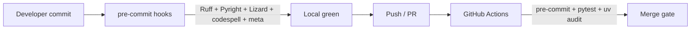

# Wire pre-commit and GitHub Actions so lint, types, complexity, spelling, audit, and tests gate every change

## Remember
- Exact file paths always
- Exact commands with expected output
- DRY, YAGNI, TDD, frequent commits
- Delegated tasks must be impossible to misread.

## Overview

The repo already has a local pre-commit config for Ruff and Pyright, but the tooling extras are incomplete, several checks fail on the current tree, Lizard is missing, and there is no CI. This plan makes the existing hooks green, adds Lizard (on `src/` and `tests/`), codespell, and standard meta hooks, installs hooks for developers, and adds GitHub Actions that run the same pre-commit suite, pytest, and `uv audit` on pull requests and pushes to `main`.

## Happy flow

A developer installs hooks once, then every commit runs format/lint/types/complexity/spelling locally. Opening a PR triggers CI that runs the same suite plus pytest and a dependency vulnerability audit; merges stay blocked until everything is green.

## Approach

Treat local pre-commit as the source of truth and make CI a thin mirror of those hooks plus pytest and `uv audit`. Prefer `uv`-managed optional extras for the Python quality tools so local and CI install the same toolchain. Fix current failures so the gate starts green; keep Lizard thresholds at defaults that today’s tree already satisfies. Resolve current LiteLLM audit findings by bumping the pin so `uv audit` exits zero (no ignore-list as the default path).

## Steps

### Step 1: Declare toolchain extras and make existing hooks pass

[steps/step1.md](./steps/step1.md) — Add optional dependency groups for Ruff, Pyright, Lizard, codespell, and pre-commit. Fix current Ruff check/format failures and ensure Pyright is installed and clean on `src/` and `tests/`.

### Step 2: Add Lizard, codespell, and meta hooks; document install

[steps/step2.md](./steps/step2.md) — Extend `.pre-commit-config.yaml` with Lizard over `src/` and `tests/`, codespell, and standard meta hooks (trailing whitespace, EOF, YAML/TOML sanity, large files, merge conflict markers). Remove the stale `ai_tools/` exclude. Document install/run commands in setup docs.

### Step 3: Add GitHub Actions CI with pytest and uv audit

[steps/step3.md](./steps/step3.md) — Add a workflow on PRs and pushes to `main` that installs with `uv`, runs `pre-commit` on all files, runs pytest, and runs `uv audit`. Bump the LiteLLM pin far enough that audit is clean, then confirm a local dry-run of the same commands.

## Revisions from review

- Lizard analyzes both `src/` and `tests/`.
- pytest is required in CI.
- codespell is in scope (pre-commit + CI via pre-commit).
- `uv audit` is in scope as a CI job; fix findings by bumping LiteLLM rather than ignoring advisories.
- Deferred: bandit, detect-secrets, deptry, conventional commits, coverage gate.

## What "done" looks like

1. Optional extras install Ruff, Pyright, Lizard, codespell, and pre-commit via `uv`.
2. `pre-commit run --all-files` exits 0, including Lizard on `src/` + `tests/` and codespell.
3. Developers can install hooks with one documented command; SETUP mentions it.
4. GitHub Actions on PRs / `main` runs pre-commit, pytest, and `uv audit`, all exiting 0.
5. LiteLLM is pinned high enough that `uv audit` reports no remaining vulnerabilities.
6. No stale path excludes that do not exist in this repo.
