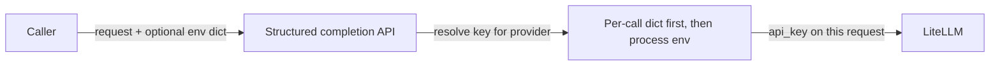

# Accept per-call credential overrides as a dict on structured completion APIs

## Remember
- Exact file paths always
- Exact commands with expected output
- DRY, YAGNI, TDD, frequent commits
- Delegated tasks must be impossible to misread.

## Overview

Callers today must put provider API keys in process environment (or a `.env` file) before the service first reads them. This plan adds an optional dict argument on the public structured-completion call sites so known API-key vars can be supplied per call, with process env remaining the fallback. Only the three registered API-key names are accepted; Bedrock continues to use the AWS credential chain unchanged.

## Happy flow

A caller invokes structured completion (or batch) with an optional credential dict. For the selected model’s provider, the matching API key is taken from that dict when present; otherwise the existing process-env path is used. The resolved key is passed on that request only and does not permanently lock shared provider state for other callers.

## Approach

Keep process-env loading as the default. Add an optional per-call dict limited to known API-key names. Resolve the key for the active provider at request time and inject it into that completion only, so shared registry instances cannot poison later calls with a different override. Reject unknown dict keys; treat empty required values as errors. Do not add constructor/DI env injection in this slice.

## Steps

### Step 1: Define runtime env contract and resolution helpers

Freeze allowed keys, per-call precedence, unknown-key rejection, and empty-value errors. Add failing unit tests for the resolver before wiring the service.

### Step 2: Wire per-call env through structured completion paths

Accept the optional dict on both public structured-completion methods. Resolve and apply the API key for the selected provider on that request only (including retries), without permanently binding shared provider instances to the override.

### Step 3: Document usage and verify

Update setup/README examples for the per-call dict. Run the full test suite and confirm env-only and per-call override paths pass.

## What "done" looks like

1. Callers can pass a dict of known API-key env vars on each structured completion / batch call.
2. Present dict values take precedence for that call; omitted keys fall back to process env / `.env`.
3. Unknown keys raise a clear error; missing/empty required keys for the active provider still raise clear errors.
4. Per-call overrides do not permanently poison shared provider registry state for subsequent calls.
5. Bedrock calls ignore API-key dicts (no API key path) and keep using AWS credentials.
6. Docs show the new call pattern; `uv run pytest` is green.

## Revisions from review

- Surface: per-call on structured completion APIs (not constructor/DI).
- Keys: only known API-key vars (`OPENAI_API_KEY`, `ANTHROPIC_API_KEY`, `OPENROUTER_API_KEY`).
- Shared-provider handling: default approach (request-scoped key injection) is acceptable.
